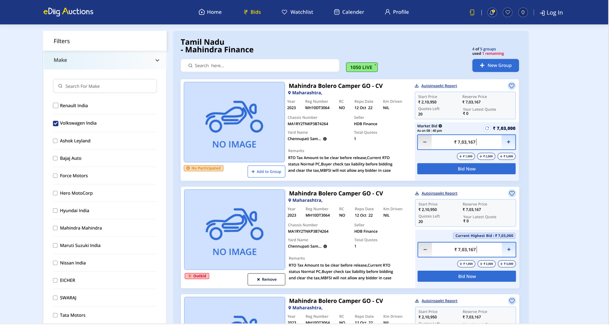
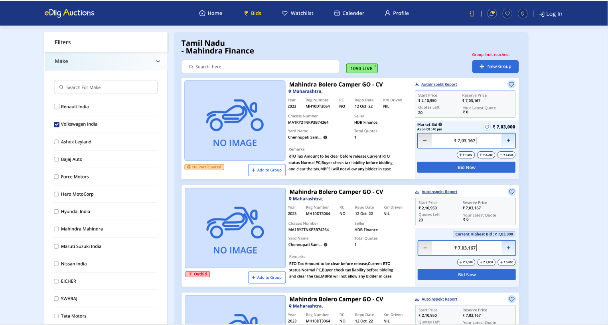
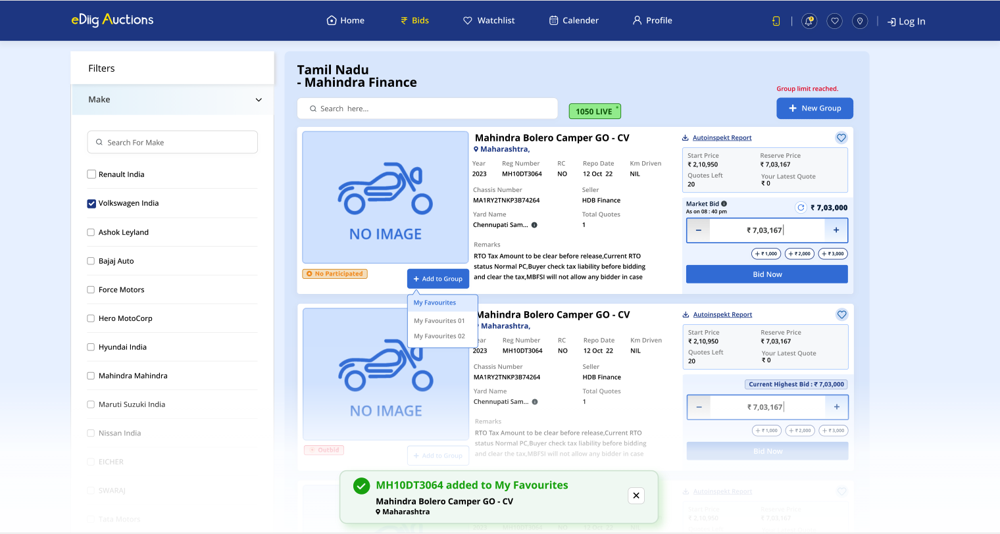
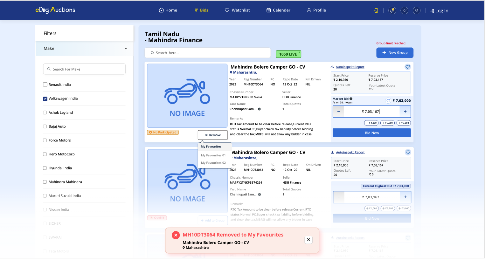
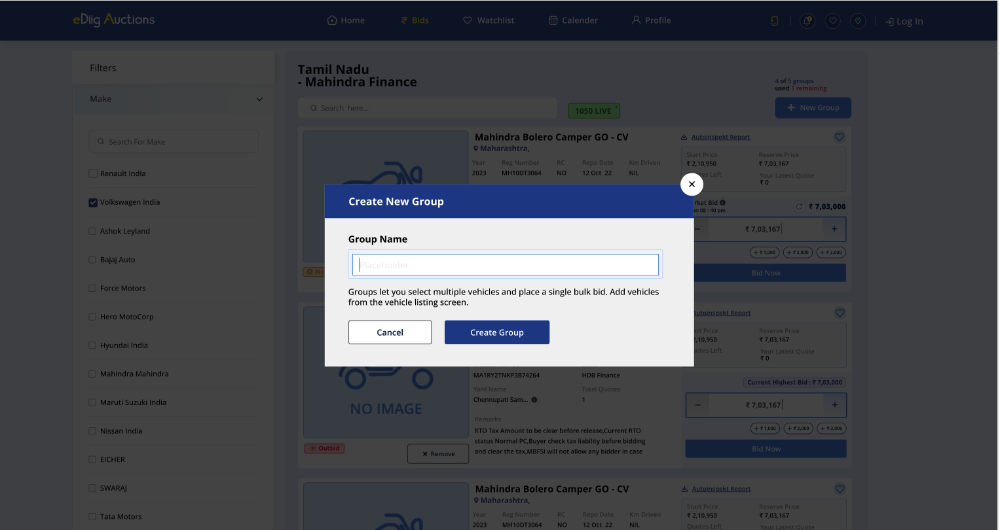
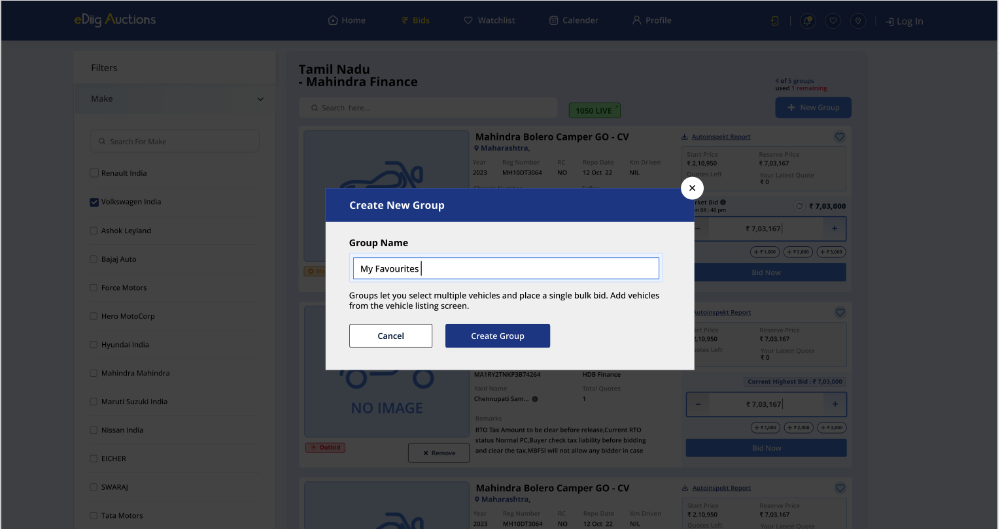
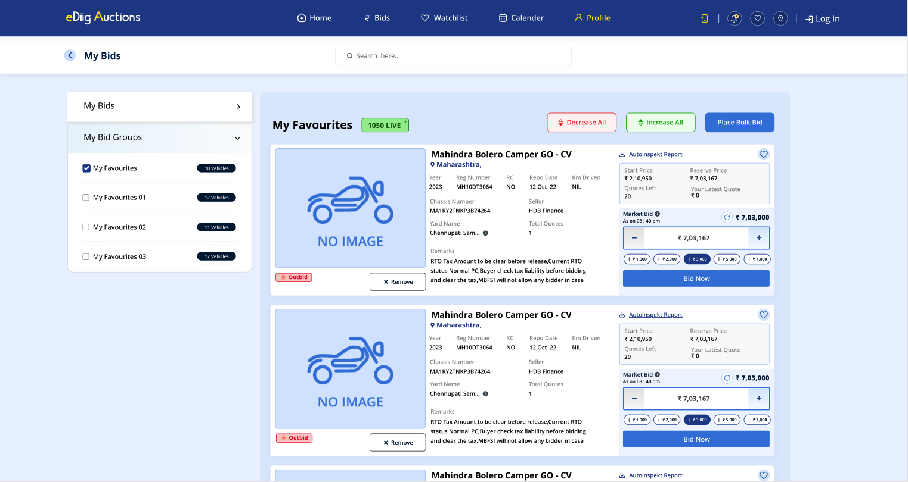
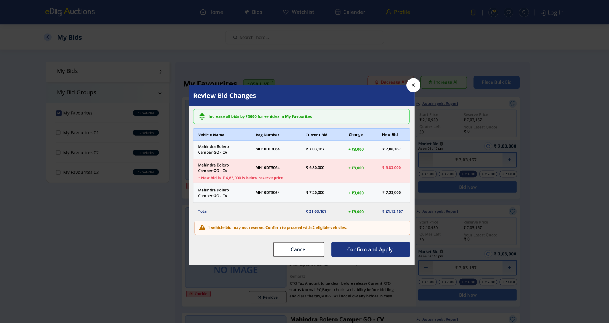
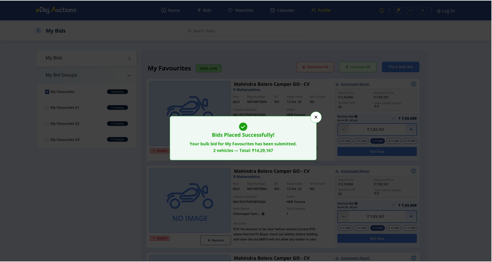

# PRD: Bulk Bid — Ediig Auction Platform

**Author:** Avinash Singh  
**Date:** 2026-05-30  
**Status:** Draft  
**Platform:** Ediig

---

## 1. Overview

Bulk Bid is a group-based bidding workflow on Ediig that lets buyers curate vehicles from bank-authorised auctions, organise them into named groups ("My Bid Groups"), and place a single confirmed bid across the entire group — with the ability to review and adjust all bids simultaneously before submitting. It replaces the repetitive one-by-one bidding process when a buyer is targeting multiple vehicles from the same or related auctions.

---

## 2. Problem Statement

Fleet buyers, dealers, and procurement managers frequently bid on multiple vehicles in a single auction or across a set of related auctions. The current experience forces them to:

1. **Bid individually** — navigate to each vehicle, set a price, confirm — repeated for every lot.
2. **Lose coordination** — price adjustments (e.g., "increase everything by ₹5,000 after market intel") must be applied manually to each vehicle.
3. **Miss the confirmation window** — placing 10+ individual bids takes time; some lots close before they get to them.
4. **Lose overview** — there is no single view that shows a buyer's total committed spend across vehicles in a session.

Bulk Bid solves this by introducing a group layer between the vehicle and the bid: buyers build groups, tune bids together, and confirm once.

---

## 3. Goals

| Goal | Metric |
|------|--------|
| Reduce time to place bids on 5+ vehicles | ≥ 60% reduction vs. individual bidding baseline |
| Give buyers a single-view spend summary | 100% of bulk sessions show live group total before confirmation |
| Prevent accidental below-floor bids | Zero bids placed below a vehicle's base/reserve price |
| Increase multi-lot participation per buyer session | ≥ 30% increase in avg. vehicles bid per session vs. individual flow |

---

## 4. Non-Goals

- Auto-bidding or auto-responding to rival bids within a group (see Auto-Bid PRD)
- Cross-auction budget pooling with shared ceiling across all groups
- Backend payment or escrow integration (outside product scope)
- AI-based bid suggestions or market price benchmarking (future phase)

---

## 5. User Personas

**Primary — Fleet Procurement Manager**  
Sources 10–50 vehicles per month from bank auctions. Has a per-vehicle budget but needs to stay within a total session budget. Needs to adjust pricing based on real-time intelligence and confirm everything before auction close.

**Secondary — Active Dealer Buyer**  
Participates in 3–5 auctions per week. Targets clusters of vehicles (e.g., all SUVs from a single SBI auction). Values speed — wants to group vehicles quickly, bump bids once, and confirm.

---

## 6. Feature Description

### 6.1 Screen 1 — Auction Listings

The entry point. Buyers discover bank-authorised auctions and select one to browse lots.

**Each auction card displays:**
- Bank name and logo
- Auction name and reference ID
- Status badge: LIVE / UPCOMING / CLOSED
- Location and sale date
- Total lot count
- Vehicle category tags (Cars, SUVs, Bikes, Trucks, Scooters)
- Contact number
- "View Lots" CTA

**Filters:**
- Status toggle chips: All Auctions / Live / Upcoming
- Dropdown filters: Bank, City

---

### 6.2 Screen 2 — Vehicle Lots in an Auction

Buyers browse vehicles in the selected auction, manage groups, and add vehicles to them.


*Vehicle lots view: filter sidebar (left), vehicle cards with bid panel (right), group counter and "+ New Group" top-right.*

**Auction header (persistent top bar):**
- Auction name (e.g., "Tamil Nadu – Mahindra Finance")
- LIVE badge with active lot count (e.g., "1050 LIVE")
- Group usage counter: "X of 5 groups used, Y remaining" — a buyer may have at most **5 groups** per auction session


*When all 5 groups are used, the counter is replaced by "Group limit reached." in red; "+ New Group" is disabled.*

**Left sidebar — Filters:**
- Make: searchable checkbox list (Renault India, Volkswagen India, Ashok Leyland, Bajaj Auto, Force Motors, Hero MotoCorp, Hyundai India, Mahindra, Maruti Suzuki, Nissan India, EICHER, SWARAJ, Tata Motors, …)

**Vehicle cards (list layout):**

| Element | Detail |
|---------|--------|
| Vehicle image | Placeholder shown as "NO IMAGE" if unavailable |
| Vehicle name | e.g., "Mahindra Bolero Camper GO - CV" |
| Location | City/state tag |
| Specs row | Year, Reg Number, RC, Repo Date, Km Driven |
| Chassis Number | |
| Seller | e.g., "HDB Finance" |
| Yard Name | e.g., "Chennupati Sam…" |
| Total Quotes | Number of quotes on this lot |
| Remarks | Free-text remarks from seller |
| Autoinspekt Report | Download link for inspection report |
| Watchlist (♡) | Save vehicle to watchlist |
| Participation badge | "No Participated" (orange) / "Outbid" (red) |
| Group action button | "Add to Group" (if ungrouped) or "× Remove" (if grouped) |
| Start Price | |
| Reserve Price | |
| Quotes Left | Remaining bid opportunities |
| Your Latest Quote | Buyer's last submitted quote (₹0 if none) |
| Market Bid | Current highest bid, with refresh icon and timestamp |
| Bid input | Editable field showing current quote |
| Quick-add chips | +₹1,000 / +₹2,000 / +₹3,000 (tappable shortcuts) |
| "Bid Now" button | Places a single individual bid for this vehicle |

**Add to Group flow:**


*Clicking "+ Add to Group" opens a dropdown listing all existing groups by name. Selecting a group adds the vehicle and shows a success toast at bottom.*

- Clicking "+ Add to Group" opens a dropdown of existing group names
- Selecting a group immediately adds the vehicle; a success toast fires: "✅ [Reg No] added to [Group Name]"
- If the vehicle is already in a group, the button changes to "× Remove"; clicking it opens the same dropdown to move or remove, and fires a removal toast


*Clicking "× Remove" shows the group dropdown; choosing a group moves the vehicle, firing a removal toast at bottom.*

---

### 6.3 Create New Group Modal

Triggered by "+ New Group" in the auction header.


*Create New Group modal with empty name field.*


*Group name entered ("My Favourites"); pressing "Create Group" creates the group and returns to the vehicle listing.*

**Modal elements:**
- Title: "Create New Group"
- Field: "Group Name" with placeholder text
- Helper: "Groups let you select multiple vehicles and place a single bulk bid. Add vehicles from the vehicle listing screen."
- Actions: Cancel | **Create Group**

---

### 6.4 Screen 3 — My Bids (Group Management)

The control centre for reviewing groups, adjusting bids in bulk, and placing the final confirmation. Accessed via the "Bids" nav link or back-arrow from the vehicle listing.


*My Bids screen: left sidebar lists "My Bids" and "My Bid Groups" (with per-group vehicle counts), right panel shows the selected group's vehicles with Decrease All / Increase All / Place Bulk Bid controls.*

**Left sidebar:**
- **My Bids** section (collapsible) — individual bid history
- **My Bid Groups** section (collapsible) — lists all groups with checkbox and vehicle count badge (e.g., "My Favourites — 18 Vehicles")
- Clicking a group checkbox selects it and loads its vehicles in the right panel

**Right panel — selected group view:**

| Component | Detail |
|-----------|--------|
| Group name | e.g., "My Favourites" |
| Auction status badge | e.g., "1050 LIVE" |
| Decrease All button | Triggers Review Bid Changes modal |
| Increase All button | Triggers Review Bid Changes modal |
| Place Bulk Bid button | Triggers bulk bid placement flow |
| Vehicle list | Each row mirrors the vehicle card from Screen 2: image, name, location, specs, bid panel with Market Bid, input field, quick chips (+₹1k / +₹2k / -₹3k / +₹5k / +₹7k), Bid Now, and "× Remove" |

---

### 6.5 Review Bid Changes Modal

Shown when "Increase All" or "Decrease All" is clicked — buyers review the impact before it applies.


*"Review Bid Changes" modal: green header shows the action, table shows per-vehicle current bid → change → new bid. Rows where the new bid is below reserve price are highlighted in red with an inline warning. A summary warning lists how many vehicles may not reserve. Confirming applies the changes.*

**Modal elements:**
- Header banner (green for increase, red for decrease): "Increase/Decrease all bids by ₹[amount] for vehicles in [Group Name]"
- Table columns: Vehicle Name | Reg Number | Current Bid | Change | New Bid
- Below-reserve rows: highlighted in red; inline note "* New bid is ₹X is below reserve price"
- Total row: aggregate current, change delta, new total
- Warning banner (amber): "⚠ [N] vehicle bid(s) may not reserve. Confirm to proceed with [M] eligible vehicles."
- Actions: Cancel | **Confirm and Apply**

**Behaviour:**
- Below-reserve vehicles are included in the preview but excluded from the applied changes
- Confirming applies the increase/decrease only to eligible vehicles

---

### 6.6 Bulk Bid Placement

Triggered by "Place Bulk Bid" in the group panel.


*Success modal after bulk bid placement: group name, vehicle count, and grand total are confirmed.*

**Success modal elements:**
- Green checkmark icon
- "Bids Placed Successfully!"
- "Your bulk bid for [Group Name] has been submitted."
- "[N] vehicles — Total: ₹[amount]"
- Close (×) button

---

## 7. Key User Flows

### Flow 1 — Create a Group and Add Vehicles
1. On Screen 2, click "+ New Group."
2. Enter group name → "Create Group."
3. On any vehicle card, click "+ Add to Group" → select group from dropdown.
4. Success toast confirms: "✅ [Reg No] added to [Group Name]."
5. Repeat for all target vehicles.

### Flow 2 — Adjust Individual Bids
1. Use the bid input field or quick-add chips (+₹1k/+₹2k/+₹3k) on any vehicle card (Screen 2 or Screen 3).
2. Bid updates in real time. Cannot go below base bid.

### Flow 3 — Apply a Bulk Adjustment
1. On Screen 3, select a group.
2. Click "Increase All" or "Decrease All."
3. Review Bid Changes modal opens — shows per-vehicle impact, flags below-reserve vehicles.
4. Click "Confirm and Apply" — changes apply to eligible vehicles only; below-reserve vehicles are skipped.
5. Group total updates in real time.

### Flow 4 — Place a Bulk Bid
1. On Screen 3, select group → click "Place Bulk Bid."
2. Success modal confirms: vehicle count + grand total.
3. Close modal — group status updates to PLACED.

### Flow 5 — Move a Vehicle Between Groups
1. On a vehicle already in a group, click "× Remove."
2. The group dropdown appears — select a different group to move the vehicle, or click outside to cancel.
3. Toast confirms the move or removal.

### Flow 6 — Navigate Between Screens
- Screen 2 → Screen 3: "Bids" nav item or "My Bids" back arrow
- Screen 3 → Screen 2: "Continue Bidding" returns to vehicle listing

---

## 8. Business Rules

| Rule | Detail |
|------|--------|
| **Group cap** | Maximum **5 groups** per buyer per auction session. "+ New Group" is disabled when the cap is reached; header shows "Group limit reached." in red. |
| **Bid increments** | Quick-chip shortcuts: +₹1,000 / +₹2,000 / +₹3,000 on vehicle listing; +₹1,000 / +₹2,000 / ±₹3,000 / +₹5,000 / +₹7,000 on My Bids view. Stepper input allows free entry. |
| **Base bid floor** | No bid can be adjusted below a vehicle's reserve price. Bulk Increase/Decrease previews the impact; below-reserve vehicles are skipped on Confirm. |
| **Vehicle → group mapping** | Each vehicle belongs to one group at a time. Moving a vehicle via "× Remove" → dropdown transfers it immediately. |
| **Group deletion** | Deletes the group and removes all its vehicles (bids reset to base). Not available on groups with PLACED status — buyer must reset first. |
| **Bulk amount** | Set by the buyer before clicking Increase All / Decrease All. Previewed in the Review Bid Changes modal before applying. |
| **Group locking** | After bulk bid placement, group status changes to PLACED. |
| **Reset** | Unlocks the group and resets all bids to base — does not cancel a bid already submitted to the backend. |
| **Group name** | Required. No explicit character cap shown in design; recommend 30 chars max. |
| **Simultaneous groups** | Up to 5 groups active per auction session. Multiple auctions can each have their own set of 5. |
| **Individual Bid Now** | Available on each vehicle card regardless of group membership. Does not affect group status. |
| **Below-reserve bulk skip** | Vehicles skipped during a bulk adjustment retain their current bid; they are not set to reserve price. |

---

## 9. UI/UX Requirements

### Visual States

| State | Indicator |
|-------|-----------|
| Ungrouped vehicle — not bid | "No Participated" orange badge; "+ Add to Group" button |
| Grouped vehicle — outbid | "Outbid" red badge; "× Remove" button |
| Group at cap (5/5) | "Group limit reached." in red; "+ New Group" disabled |
| Below-reserve row in review modal | Row highlighted red; inline warning note |
| Bulk bid placed | Success modal with green checkmark; group status → PLACED |

### Notifications (Toasts)

| Event | Type | Message |
|-------|------|---------|
| Vehicle added to group | Success | "✅ [Reg No] added to [Group Name] — [Vehicle Name], [City]" |
| Vehicle removed from group | Error/Info | "✖ [Reg No] Removed to [Group Name] — [Vehicle Name], [City]" |
| Bid below base attempted | Error | "Cannot go below base bid of ₹X" |
| Bulk bid placed | Success modal | "Bids Placed Successfully! … [N] vehicles — Total: ₹[amount]" |
| Group reset | Info | "Group reset — bids cleared to base" |
| Group name empty | Warning | "Group name is required" |

Toast position: bottom-centre. Auto-dismiss: ~4 seconds (with manual close ×).

### Responsive Behaviour

| Breakpoint | Change |
|-----------|--------|
| < 700px | Filter sidebar collapses; vehicle list goes single-column; bulk controls stack vertically and go full-width |

---

## 10. Data Model (Logical)

```
Auction
  id, bank, name, ref, location, city, saleDate
  status (live / upcoming / closed)
  totalLots, categories[]

Vehicle
  id, auctionId, name, year
  type (4w / 2w)
  fuel, odometer, city
  startPrice, reservePrice, currentMarketBid
  bidInput (buyer's current quote), quotesLeft
  lotNumber, chassisNumber, seller, yardName, remarks

Group
  id, buyerId, auctionId, name
  status (active / placed)
  vehicleIds[]
  createdAt
  -- max 5 per buyer per auction

BidEntry
  vehicleId, groupId, buyerId
  bidAmount, reservePrice
  placedAt

BulkBidConfirmation
  confirmationId, groupId, buyerId
  vehicles[{ vehicleId, bidAmount }]
  eligibleCount, grandTotal
  placedAt
```

---

## 11. Edge Cases & Error Handling

| Scenario | Behaviour |
|----------|-----------|
| Bulk adjustment would push vehicle below reserve | Shown in Review Bid Changes modal as a red row with inline warning. Vehicle is skipped on "Confirm and Apply"; amber banner states count of skipped vehicles. |
| Buyer tries to add vehicle to a 6th group (cap reached) | "+ New Group" is disabled; "Group limit reached." shown. Buyer must delete an existing group first. |
| Buyer tries to add vehicle already in another group | "× Remove" dropdown allows moving directly to another group in one step. |
| Buyer tries to delete a group with PLACED status | Block with error: "Cannot delete a group with bids placed. Reset the group first." |
| Auction closes while group is ACTIVE | Lock the group automatically; notify buyer: "Auction closed — your group has been locked at current bids." |
| Confirmation modal dismissed mid-flow | No bids placed; group remains ACTIVE and editable. |
| Reset on a group where bids were already sent to backend | Reset UI only; backend bids are not cancelled. Surface a clear disclaimer in the Reset confirmation. |
| Zero vehicles in group when "Place Bulk Bid" clicked | Disable button; tooltip: "Add at least one vehicle to place a bulk bid." |
| All vehicles in a group are below reserve | "Confirm and Apply" is blocked; all rows shown red in review modal; amber banner: "0 eligible vehicles." |

---

## 12. Success Metrics (Post-Launch)

| Metric | Target (90 days post-launch) |
|--------|------------------------------|
| Bulk Bid adoption (% of multi-vehicle sessions using groups) | ≥ 35% |
| Avg. vehicles per bulk bid group | ≥ 4 |
| Time to confirm a 5-vehicle group bid vs. individual | ≥ 50% faster |
| Below-reserve-bid errors reaching backend | 0 |
| Group reset rate (proxy for buyer regret) | < 15% of PLACED groups |
| Support tickets related to Bulk Bid | < 5% of Bulk Bid sessions |

---

## 13. Open Questions

1. **Backend bid submission** — Is "Place Bulk Bid" a single atomic API call or N individual calls? If atomic, what is the rollback behaviour if some vehicles fail?
2. **Cross-auction groups** — Can a buyer add vehicles from two different auctions into the same group? Currently scoped to per-auction; confirm if cross-auction is needed.
3. **Bid validity window** — How long is a placed bulk bid valid? Does the platform hold the bid or is it subject to change by the auctioneer?
4. **Reset behaviour post-submission** — Should Reset cancel the backend bid (requires API), or only reset the UI state? Needs policy decision.
5. **Concurrent buyers on same lot** — If two buyers bid on the same vehicle simultaneously via Bulk Bid, how does conflict resolution work?
6. **Group cap configurable?** — The design hard-codes 5 groups per auction. Should this be configurable by auction type or buyer tier?
7. **Notifications** — Should bulk bid placement trigger an SMS/WhatsApp confirmation to the buyer?
8. **Audit & export** — Does the buyer need a downloadable summary (CSV/PDF) of their placed bulk bids for internal approvals?

---

## 14. Milestones

| Phase | Scope | Target |
|-------|-------|--------|
| **M1 — Group Management** | Create, name, delete groups (max 5); assign/remove/move vehicles; group counter; group limit state | TBD |
| **M2 — Bid Controls** | Individual bid input + quick chips, stepper; base bid floor enforcement | TBD |
| **M3 — Bulk Adjustment** | Increase All / Decrease All; Review Bid Changes modal with reserve-price validation; below-reserve skip | TBD |
| **M4 — Bulk Bid Placement** | Place Bulk Bid → success modal; PLACED status | TBD |
| **M5 — Reset & Re-bid** | Reset flow, UI unlock, disclaimer for submitted bids | TBD |
| **M6 — Filters & Discovery** | Make filter sidebar wired to data; auction status live count | TBD |
| **M7 — Notifications & Export** | SMS/WhatsApp confirmation; bid history export | TBD |
